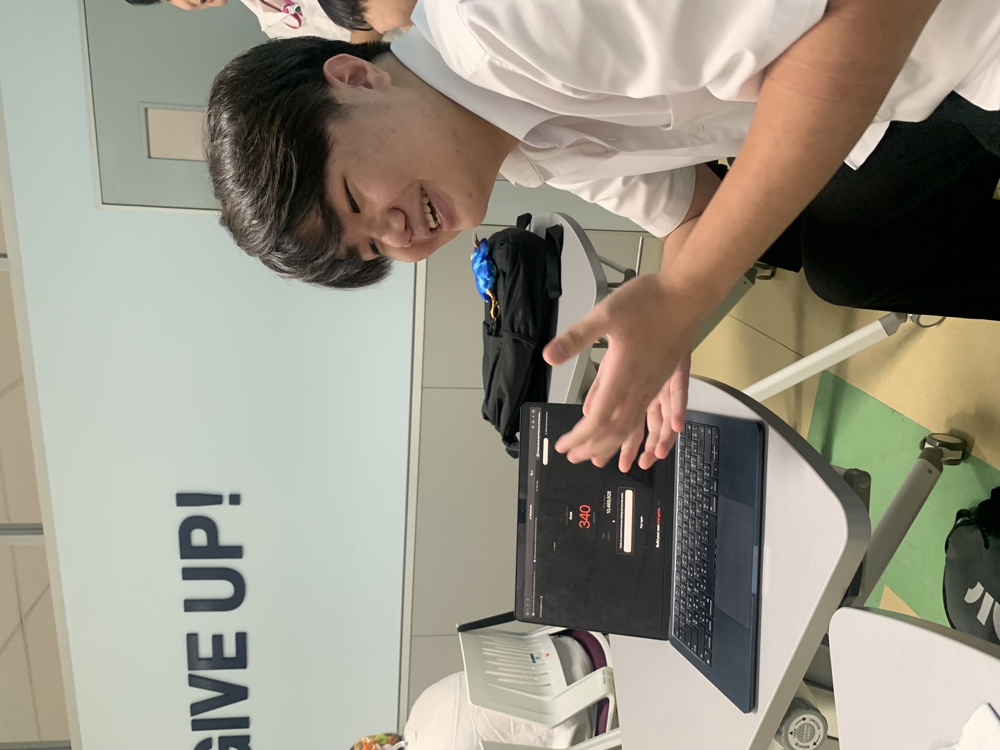
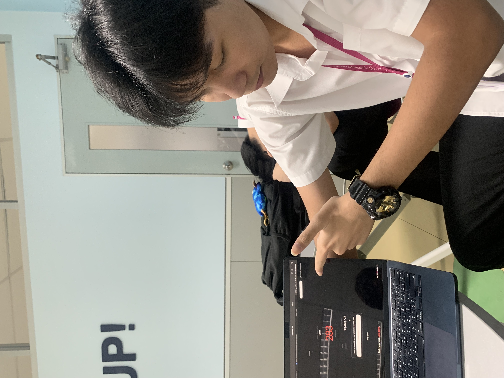

# GoonShop 🛒❄️

**GoonShop** is a full-stack web application for a Frozen Food Retail business. It serves as a comprehensive catalog and management system for various frozen food products, including raw meats, poultry, seafood, and ready-to-eat meals.

## 🌟 Features
- **Product Catalog**: Browse a wide variety of frozen food products.
- **Search & Filter**: Find products easily by name, brand, price range, or ingredients.
- **Admin Dashboard**: Secure login for administrators to manage inventory.
- **Product Management**: Create, Read, Update, and Delete (CRUD) operations for products.
- **Responsive Design**: Beautiful UI built with HTML/CSS/JS that works seamlessly across devices.

## 🚀 Technologies Used
- **Frontend**: HTML5, CSS3, Vanilla JavaScript
- **Backend API**: Node.js, Express.js
- **Database**: MySQL (Hosted on Aiven Cloud)
- **Deployment**:
  - Frontend hosted on **GitHub Pages**
  - Backend API hosted on **Render.com**

## 👥 Meet the Team (Section 1, Group 02)

| Photo | Name | Student ID | Role |
| :---: | :--- | :---: | :--- |
|  | **Chutchanun Jirapapongpun** | 6788027 | Frontend / Design |
|  | **Napat Tayommai** | 6788127 | Frontend / Backend |
|  | **Kritsakorn Thammas** | 6788129 | Backend / Design |
|  | **Thanapat Wongthongtham** | 6788145 | Frontend / Database |
|  | **Tantikorn Lapkloyma** | 6788241 | Report / Reviewer |

## 📦 Project Structure
- `/sec1_gr02_fe_src`: Frontend source code (HTML, CSS, JS, Images)
- `/sec1_gr02_ws_src`: Backend API source code (Node.js, Express)
- `sec1_gr02_database_cloud.sql`: Database schema and initial data

## ⚙️ How to Run Locally

### 1. Backend Setup
1. Open your terminal and navigate to the backend folder:
   ```bash
   cd sec1_gr02_ws_src
   ```
2. Install dependencies:
   ```bash
   npm install
   ```
3. Run the server:
   ```bash
   npm start
   ```

### 2. Frontend Setup
1. Open the `/sec1_gr02_fe_src/html/` folder.
2. Open `index.html` in your web browser (using an extension like **Live Server** in VS Code is highly recommended).
